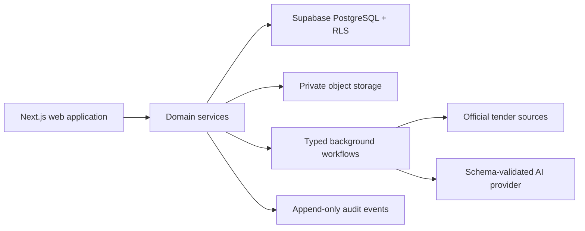

# System overview

The initial implementation is a modular monolith. Provider interfaces allow
deterministic local behavior until hosted credentials exist. Tenant scope is
explicit in data and must be enforced at both service and database layers.
