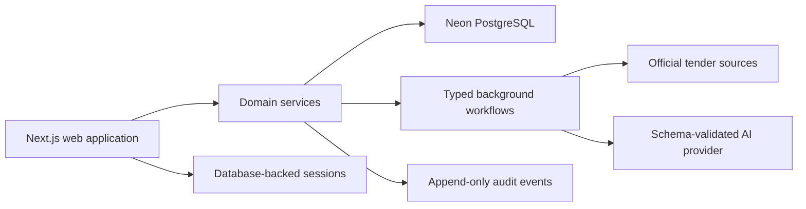

# System overview

The implementation is a modular monolith. Public opportunity ingestion uses
the official TED Search API and stores raw source payloads plus immutable
versions. Tenant scope is explicit in data and enforced by server-side domain
services. Authentication uses opaque, hashed session tokens in Neon.
